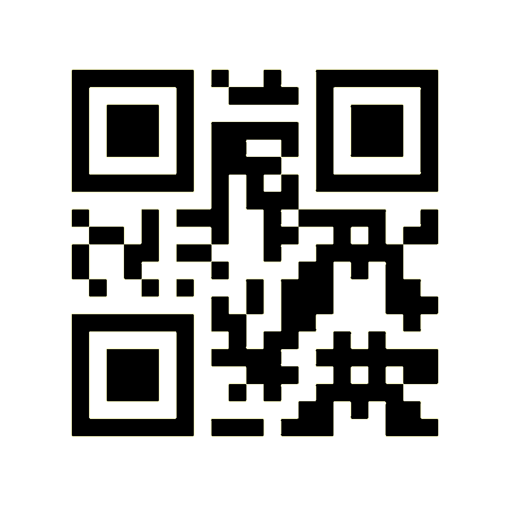
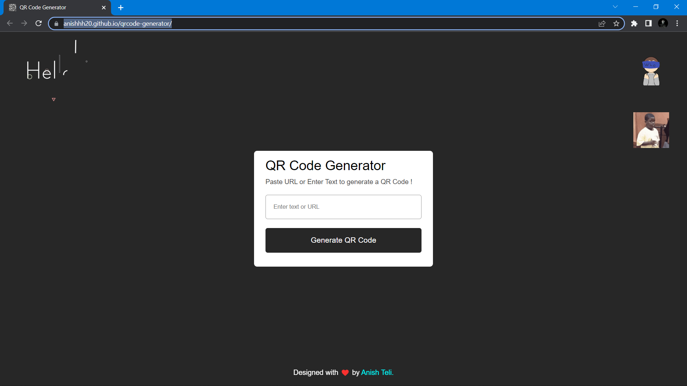
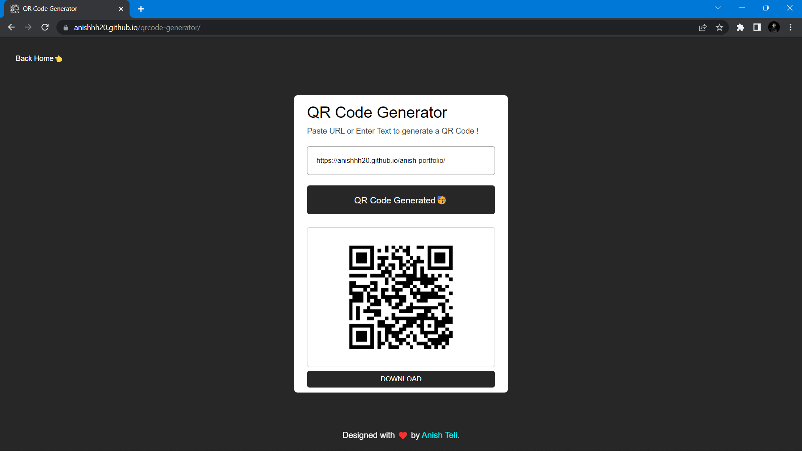
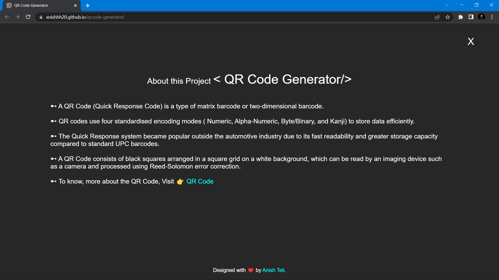

# QR Code Generator !!
[🔗 Visit Site!!](https://anishhh20.github.io/qrcode-generator/)

 
 
Used simple and basic HTML, CSS, and JavaScript, I created a Responsive QR Code Generator Site.
  

[]
[]
[]
[]     

## 📌Sneak Peek 😁👇🏼

<h2>📬 Contact</h2>

If you want to contact me, you can reach me through below social handles.

<a href="mailto:anishteli238@gmail.com">

